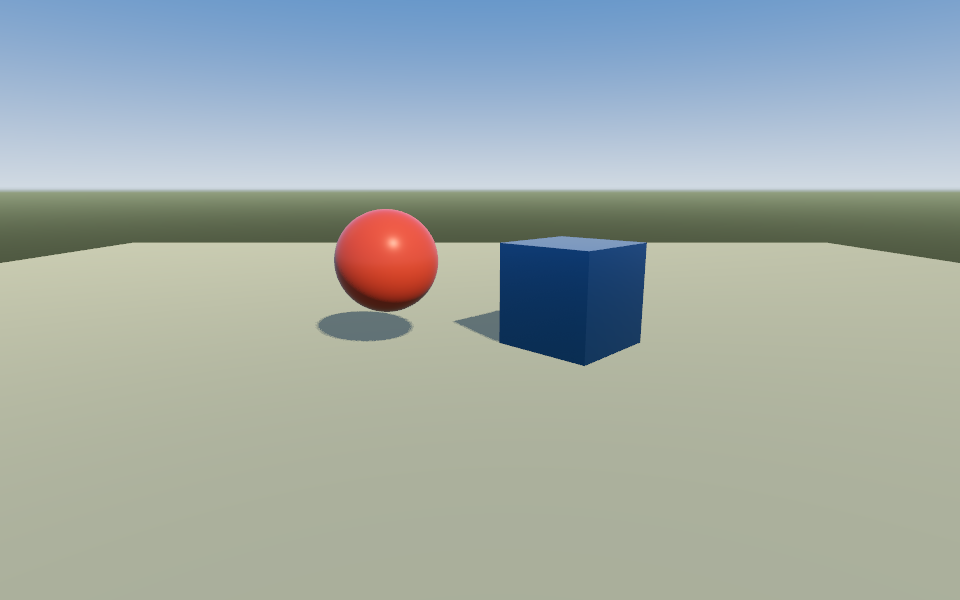
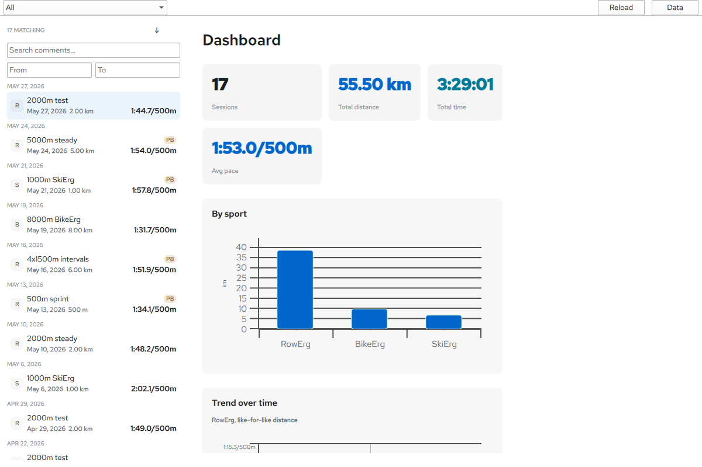
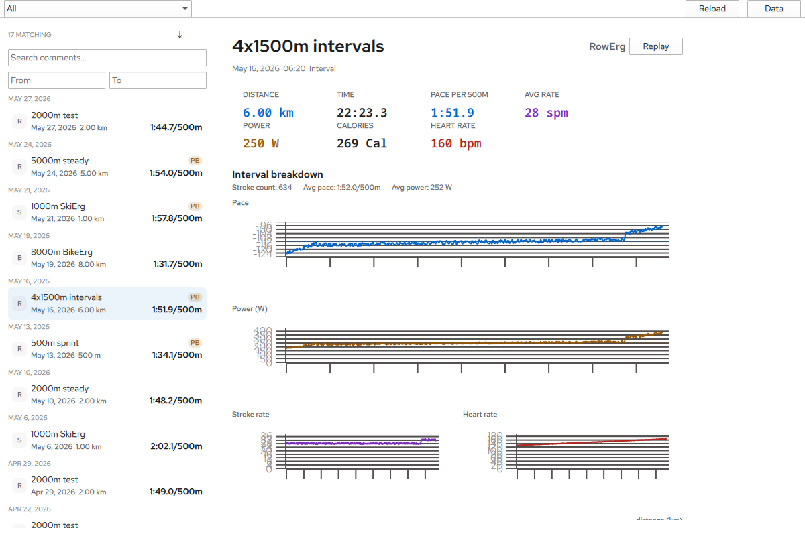
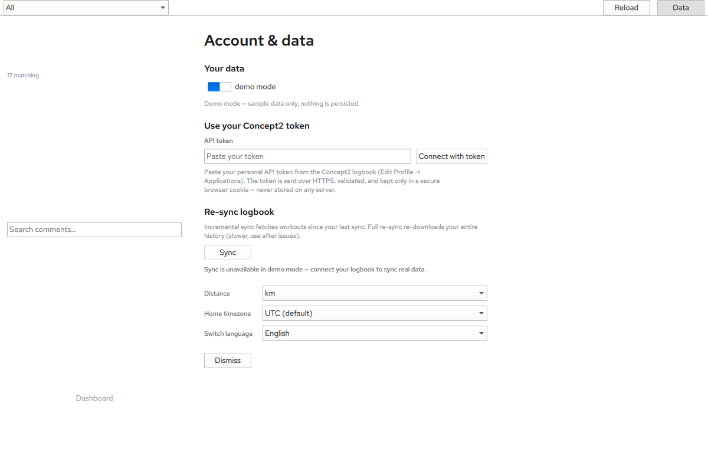
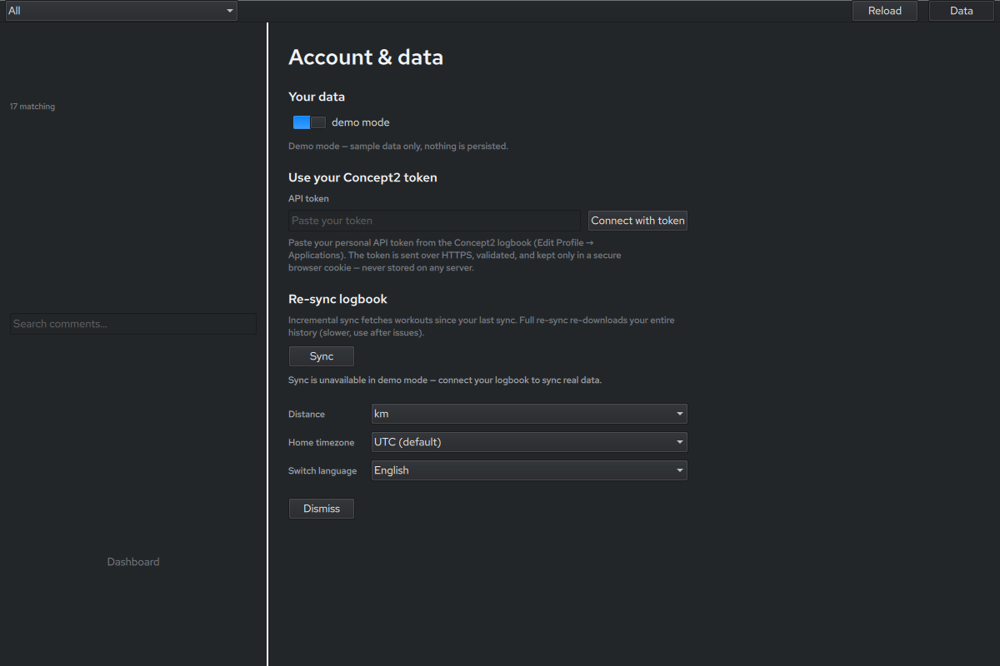
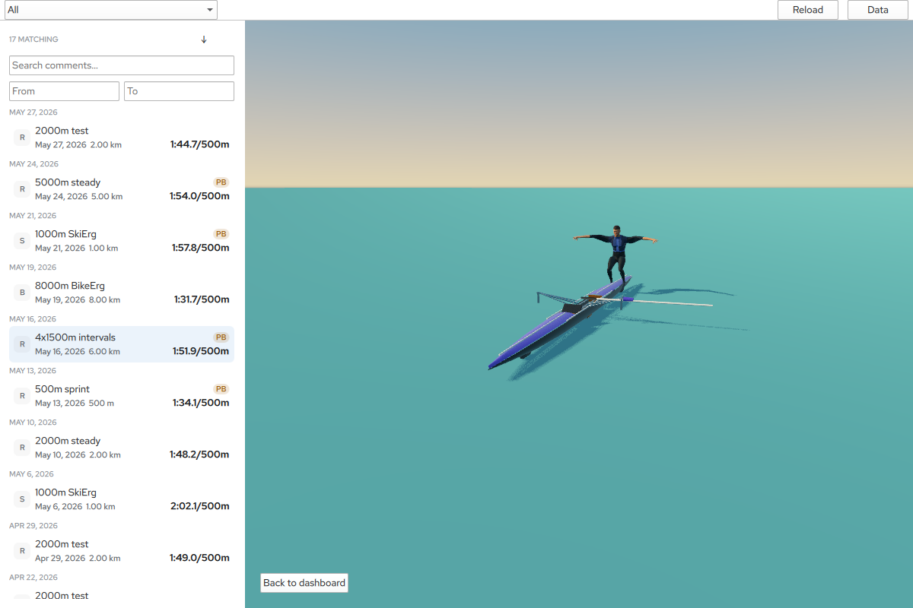
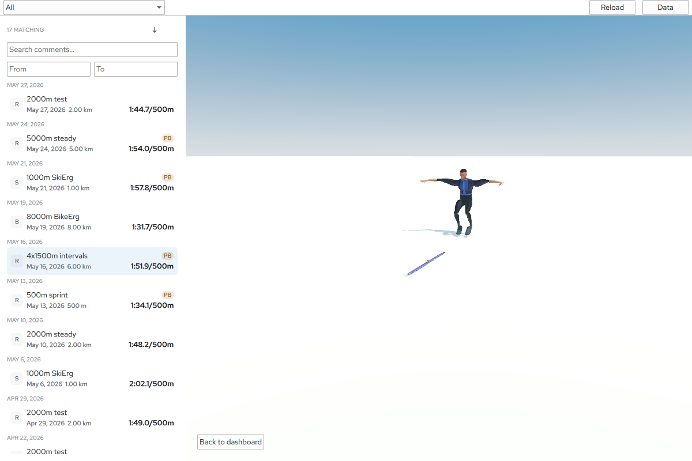
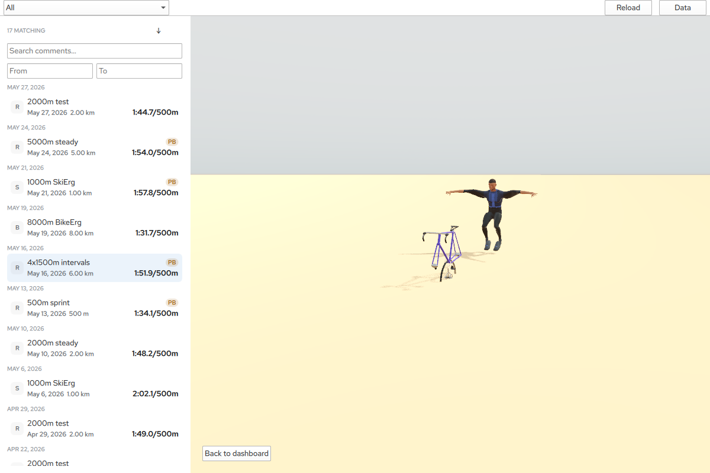
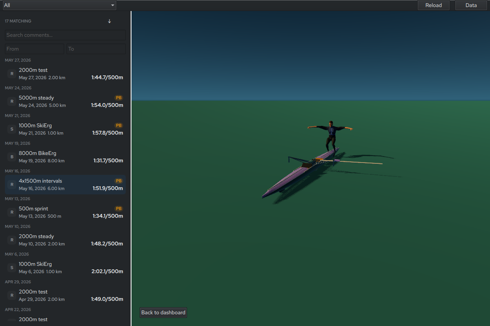

# rowplay-qt

Cross-platform (Linux, macOS, Windows) desktop port of
[rowplay](https://github.com/shenghaoc/rowplay), a Concept2 logbook analytics
and real-time workout replay app for RowErg, SkiErg and BikeErg athletes.

- **Rust** implements all application logic (`crates/rowplay-core`,
  `crates/rowplay-platform`).
- **Qt Bridges for Rust** (`qtbridge`, public beta) exposes Rust objects to
  **QML / Qt Quick**; **Qt Quick 3D** renders the replay and **Qt Graphs** the
  charts, on **Qt 6.11**. No hand-written C++.
- The web app is the canonical behaviour and
  [rowplay-studio](https://github.com/shenghaoc/rowplay-studio) (native macOS)
  supplies the layering and the golden parity fixtures that every port is
  tested against.

Not affiliated with Concept2. Concept2, RowErg, SkiErg and BikeErg are
Concept2 trademarks.

## Why

One native code base for three desktop platforms, with a real 3D replay and
charts, without a second C++ code base. The decisions behind the stack are
recorded as ADRs in [`docs/decisions/`](docs/decisions/README.md).

## Status

Phases 0–8 are done (Phase 8, live mode, is in review); Phase 9 adds the
packaged builds — see [Packaged builds](#packaged-builds). The bullets below
are the phase summaries as each landed.

- **Phase 5a — replay assets and scene:** the rowplay V3 rig pack, V4 athlete
  and Poly Haven environment textures vendored with provenance and a SHA-256
  pin; a Qt-free V3 contract validator with named-slot errors; the
  material-role, venue-palette and anchor tables in `rowplay-viewmodel`;
  `build.rs` converting both packs with Qt's `balsam` into a generated QML
  module in every build (ADR 0008); and the replay scene — procedural-sky
  IBL, the web's per-sport key light casting shadows, a palette-tinted ground
  plane, the current sport's equipment placed at its anchors and the unposed
  athlete — captured per sport by the runtime-error gate. Playback is
  Phase 5b.

- **Phase 4 — QML shell:** the Qt-free `rowplay-viewmodel` crate, the design-token
  theme (light/dark), the application shell, the settings screen (keyring
  token, units, home timezone, language, demo mode, threaded sync), the
  six-language i18n pipeline generated from the web locales, and the screens:
  day-sectioned library sidebar, dashboard (metric tiles, personal bests,
  Qt Graphs trend charts), workout detail (metric strip, splits/intervals,
  targets) and stroke analysis (pace, power, rate and heart-rate charts).

- **Phase 1–2 — `rowplay-core`:** the pure ports of the web app's models,
  formatting, datetime, pace input, privacy redaction, analytics, personal
  bests, performance predictor, workout query, tags and deterministic demo
  library, plus the whole replay core (engine, motion, stroke model, motion
  graph, 2D kinematics, ghost pick, race gap / result, rival parsers and the
  quality budgets), all with parity tests.
- **Phase 3 — `rowplay-platform`:** the Concept2 raw-payload mapper, the
  blocking `ureq` HTTPS client (HTTPS-only, same-origin redirects only, strict
  timeouts, 25 MiB body cap), the OS-keychain token store, the `rusqlite`
  workout cache, the JSON preferences store and the synchronous cancellable
  sync coordinator.

- **Phase 4a — shell foundation:** `rowplay-viewmodel` (Qt-free UI logic),
  `Theme.qml` (Studio's design tokens, light/dark via the system colour
  scheme), the Fusion-styled application shell, the settings screen (keyring
  token, units, home timezone, language, demo mode, threaded sync) and the
  six-language i18n pipeline generated from the web locales.

See [`docs/roadmap.md`](docs/roadmap.md) for every phase.



| Dashboard (demo data) | Workout detail (demo data) |
| --- | --- |
|  |  |

| Settings (light) | Settings (dark) |
| --- | --- |
|  |  |

| RowErg | SkiErg | BikeErg |
| --- | --- | --- |
|  |  |  |

The same scene follows the dark scheme (`ROWPLAY_FORCE_COLOR_SCHEME=dark`):



## Requirements

- Rust ≥ 1.87 (stable toolchain with `rustfmt` and `clippy`).
- Linux only, for the keyring Secret Service backend, the `libdbus-1` headers
  at build time: `libdbus-1-dev` and `pkg-config` on Debian/Ubuntu, `dbus-devel`
  and `pkgconf` on RHEL/Fedora. macOS (Keychain) and Windows (Credential
  Manager) use system frameworks and need nothing extra.
- For the app: Qt 6.11 with the Quick 3D, Shader Tools, Quick Timeline and
  Graphs modules, a C++ toolchain, and `qmake` on `PATH` (or `QMAKE` set).
  `build.rs` also needs Qt's `balsam` tool (part of the Quick 3D module) to
  convert the replay packs; it is found through `qmake` like `rcc`, and
  `ROWPLAY_BALSAM` overrides the executable. Qt-free crates build without any
  of that.

## Build and run

```bash
cargo test                          # core + platform + fixtures, no Qt needed
cargo build -p rowplay-app          # needs Qt
cargo run -p rowplay-app            # Phase 0 smoke window
```

No test in the default run touches the network or a real credential store: the
HTTP rules are exercised against a local `TcpListener` server and every service
has an in-memory mock. The round trip against the real OS keychain is opt-in,
because CI has no Secret Service and macOS prompts:

```bash
ROWPLAY_KEYRING_TESTS=1 cargo test -p rowplay-platform
```

Headless screenshot test on Linux (Xvfb + Mesa):

```bash
QT_QPA_PLATFORM=xcb QSG_RHI_BACKEND=opengl LIBGL_ALWAYS_SOFTWARE=1 \
  ROWPLAY_QT_SMOKE=1 ROWPLAY_SMOKE_ARTIFACT_DIR=$PWD/artifacts \
  xvfb-run -a cargo test -p rowplay-app
```

On macOS no Xvfb is needed — the app renders through the normal window server
and writes the same artifacts:

```bash
ROWPLAY_QT_SMOKE=1 ROWPLAY_SMOKE_ARTIFACT_DIR=$PWD/artifacts \
  cargo test -p rowplay-app
```

## Installing Qt locally

CI uses `jurplel/install-qt-action`; for a local build `aqtinstall` fetches the
same archives. Install the modules the app imports and leave the **default
archives** alone: on Linux the defaults are what bring `qtwayland`, so the app
runs natively under Wayland (a restricted `--archives` list would drop it).

```bash
python3 -m venv ~/.venvs/aqtinstall
~/.venvs/aqtinstall/bin/pip install "aqtinstall==3.3.*"
# Where python3-pip/venv are not installed (minimal RHEL 10), any pip works:
# `pipx install aqtinstall` or `uv tool install aqtinstall`.

# Linux — the desktop architecture is linux_gcc_64
~/.venvs/aqtinstall/bin/aqt install-qt linux desktop 6.11.2 linux_gcc_64 \
  -m qtquick3d qtshadertools qtquicktimeline qtgraphs --outputdir ~/Qt

# macOS
~/.venvs/aqtinstall/bin/aqt install-qt mac desktop 6.11.2 clang_64 \
  -m qtquick3d qtshadertools qtquicktimeline qtgraphs --outputdir ~/Qt
```

`qmake` must be on `PATH` (or `QMAKE` set) for `build.rs` to find `rcc`:

```bash
export PATH="$HOME/Qt/6.11.2/macos/bin:$PATH"        # .../gcc_64/bin on Linux
export QMAKE="$HOME/Qt/6.11.2/macos/bin/qmake"
cargo build -p rowplay-app
```

On macOS nothing else is needed: `build.rs` links the binary with an
`LC_RPATH` for the Qt install (and one for `@executable_path/../Frameworks`,
which the `.app` bundle uses), so `cargo run` and `cargo test` find the
frameworks without any `DYLD_*` variable (note 10 in
[`docs/qt-bridges-notes.md`](docs/qt-bridges-notes.md) has the history). The
committed `.envrc` exports the paths above for both the Linux and the macOS
install locations.

On a Wayland desktop the app runs natively (`QT_QPA_PLATFORM` unset — Qt picks
`libqwayland`) and the headless tests need no Xvfb:
`QT_QPA_PLATFORM=wayland QSG_RHI_BACKEND=opengl LIBGL_ALWAYS_SOFTWARE=1
ROWPLAY_QT_SMOKE=1 cargo test -p rowplay-app` passes on RHEL 10.2 with Qt
6.11.2 (verified; Xvfb is not even installed there).

Demo mode is first-class: everything is explorable with deterministic seeded
data and no Concept2 token.

## Packaged builds

Phase 9 ships installers built by
[`.github/workflows/release.yml`](.github/workflows/release.yml) from a `v*`
tag (as a draft release the author publishes) and, as plain workflow
artifacts, from every pull request that touches a packaging input. Each
package is started on its own runner from a clean environment and must
render 30 frames and exit cleanly before it is kept (ADR 0012).

| Platform | Artifact | Install |
| --- | --- | --- |
| macOS 13+ (Apple silicon) | `rowplay-qt-<version>-macos-arm64.dmg` | Open the image, drag **rowplay** to Applications. The bundle is ad-hoc signed, not notarised: on first launch macOS refuses it; right-click the app → **Open** → **Open**, or `xattr -d com.apple.quarantine /Applications/rowplay-qt.app`. |
| Windows 10/11 (x64) | `rowplay-qt-<version>-windows-x86_64-setup.exe` (or the portable `.zip`) | Run the installer (per-user by default; it installs the Microsoft VC++ runtime if needed). It is unsigned: SmartScreen shows "Windows protected your PC" → **More info** → **Run anyway**. |
| Linux (x86_64, X11 or Wayland) | `rowplay-qt-<version>-linux-x86_64.AppImage` | `chmod +x` and run. Without FUSE 2: `APPIMAGE_EXTRACT_AND_RUN=1 ./rowplay-qt-….AppImage`. |

Every artifact has a `.sha256` sidecar and each release a `SHA256SUMS`.

To build a package locally (same prerequisites as the app build, plus
Inno Setup 6 on Windows; the Linux script fetches pinned, SHA-256-verified
`linuxdeploy` tools into `tools/package/.cache/`):

```bash
tools/package/macos.sh      # dist/rowplay-qt.app + .dmg
tools/package/linux.sh      # dist/*.AppImage (needs xvfb-run when headless)
pwsh tools/package/windows.ps1   # dist/*-setup.exe + .zip
```

`ROWPLAY_EXIT_AFTER_FRAMES=N` makes any build of the app quit after N
rendered frames; it is what the launch check uses and is safe to leave set
nowhere else.

## Layout

```
crates/rowplay-core       pure domain logic (no Qt, no I/O)
crates/rowplay-platform   services behind traits with mocks (no Qt)
crates/rowplay-viewmodel  Qt-free UI logic: navigation, dates, settings, screens
crates/rowplay-app        qtbridge binary, QML shell, Qt Quick 3D
crates/rowplay-fixtures   dev-only loader for tests/fixtures
qml/                      QML modules            tests/fixtures/  golden parity JSON
assets/  i18n/  tools/    assets, locales, pipeline scripts
docs/                     roadmap, source map, Qt Bridges notes, ADRs
.kiro/specs/              per-phase requirements / design / tasks
```

`AGENTS.md` is the canonical guide for contributors and coding agents.

## Licence

GPL-3.0-or-later (Qt Quick 3D and Qt Graphs are GPLv3-only in the open-source
Qt edition). Vendored assets and fixtures keep their original MIT / CC0 terms;
see `LICENSES/`, `ASSET_PROVENANCE.md` and `tests/fixtures/PROVENANCE.md`.
