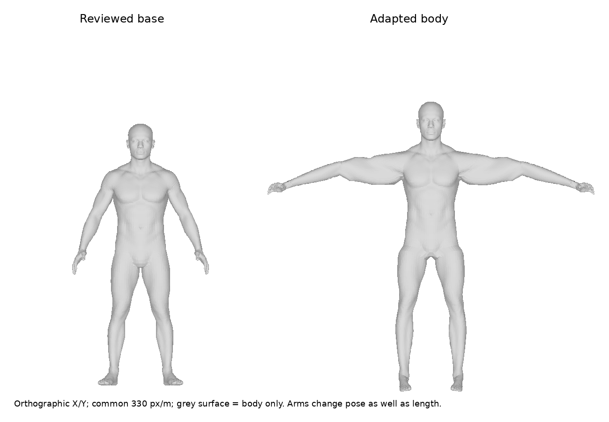
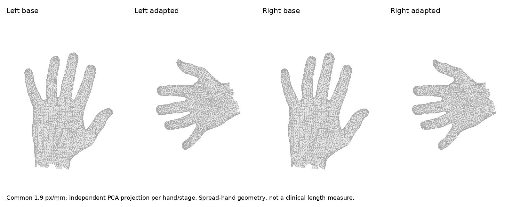
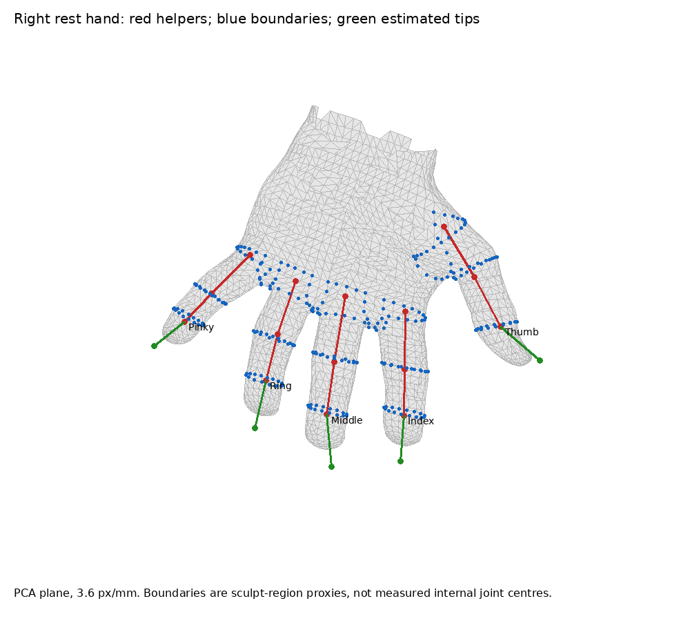
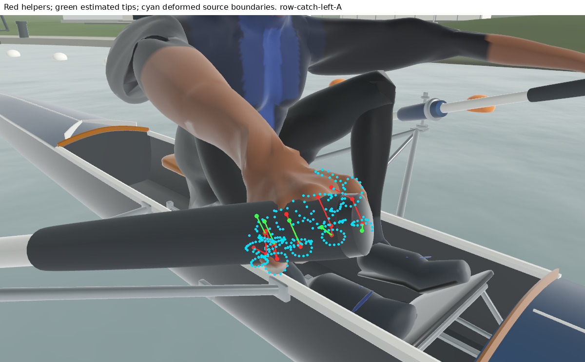
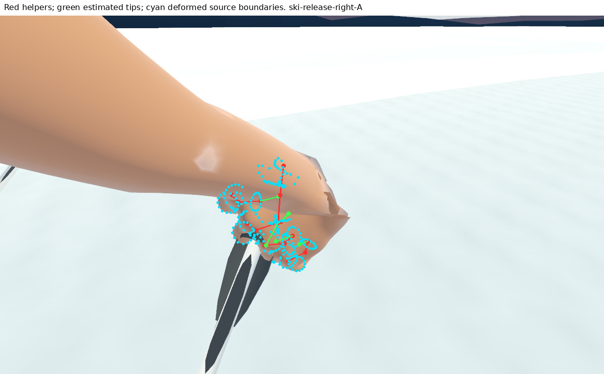
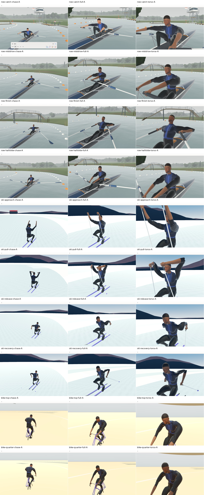
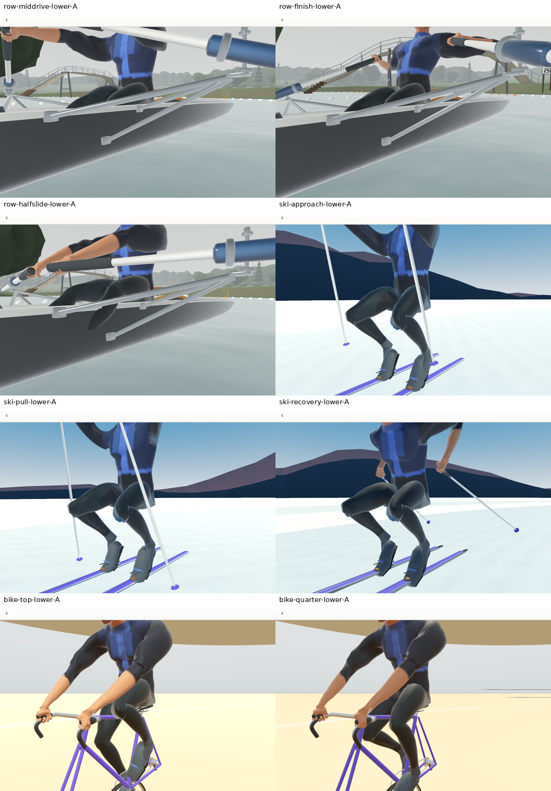
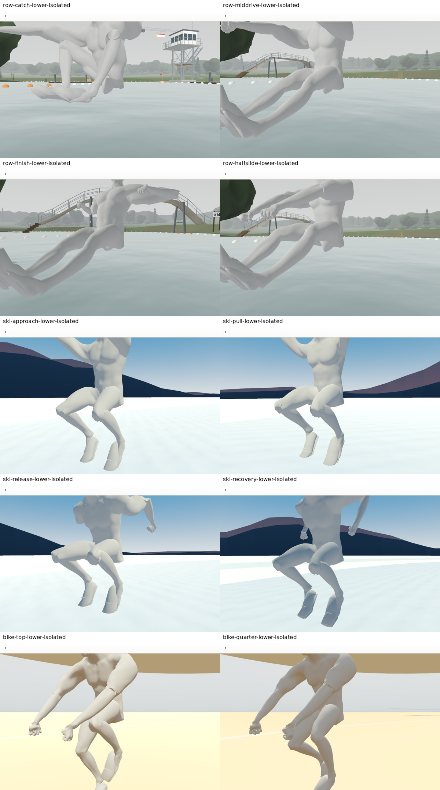
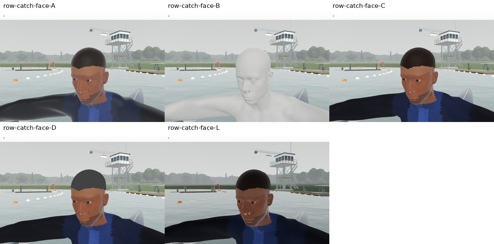
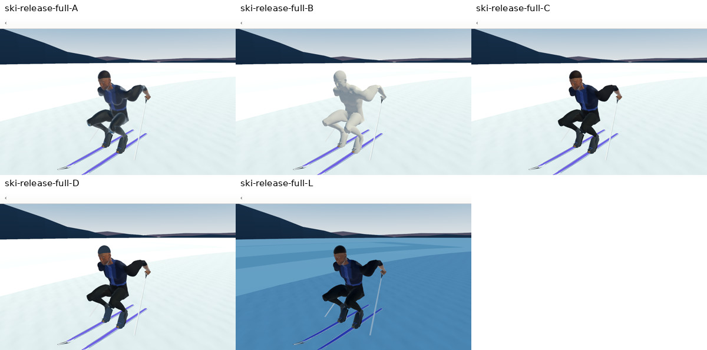

# Blender Phase 5.2 — existing V4 athlete audit

**Status: audit complete; no athlete route selected.** This is evidence for
Phase 5.3 under [ADR 0017](decisions/0017-athlete-contact-truth-and-hero-fit.md),
not a retain/refine/replace recommendation. Production assets, QML, materials,
rig, helpers, weights and contact architecture are unchanged. The corrected
Phase 5.0 baseline and [Phase 5.1 contact audit](blender-phase5-contact-audit.md)
remain authoritative, including their unresolved calibration questions.

**FACT** means directly inspected source/runtime state; **MEASUREMENT** means
a named instrument and its stated domain; **INFERENCE** means interpretation
of those observations; **OPEN QUESTION** means this audit cannot isolate the
cause without a later intervention. Numeric thresholds below describe data,
not newly approved human, contact or modelling acceptance thresholds.

## Asset identity and three-stage lineage

**FACT:** started from current main
`63c823cb0663a4c05d72ee34159901ebd764b9d1`. Refetched web main
`173c6facbcedef419ad39168c5e3e642abb7e57e` and Studio main
`3d406a5b7677372de35fb0817c7133a2589c6564`; neither pin moved.
The shipped `rowplay-athlete-v4.glb` is 4,584,320 bytes, SHA-256
`a564a4dbd4922e2ba76ef21a23f5bf0eb1b0180846548f9d7110e55ffd8f760e`,
matching the web artifact and current contract. Counts were decoded from its
accessors, hierarchy and exact-position connectivity rather than copied from
the contract: **57,069 export vertices, 106,256 triangles, 28 components,
one mesh/primitive/skin/material; 19 semantic + 32 helper = 51 joints**.
There are no embedded textures and no TANGENT accessor.

| Stage | Actual authority at the pinned web commit | Origin of the relevant characteristics |
| --- | --- | --- |
| CC0 anatomical base | Blender Human Base Meshes v1.4.1, Dan Ulrich / Blender Studio; official [bundle](https://download.blender.org/demo/asset-bundles/human-base-meshes/human-base-meshes-bundle-v1.4.1.zip) | Human surface, sculpt face-set regions, UV layout, anatomical loops |
| Reviewed snapshot | `scripts/extract-replay-athlete-base-blender.py` → `static/replay-assets/source/rowplay-human-base-male-v1.4.1.blend` | Realistic male body and two eyes, one applied Multires level, library layout removed; no remaining modifiers or vertex groups |
| RowPlay adaptation | `scripts/build-replay-athlete-v4-blender.py` | Global scale, articulated segment retargeting, seat-channel shape, deterministic weights, vertex-colour skin/clothes/face, added hair/face/shoe details |
| Rig and helpers | `src/lib/replay/rigV4.ts`; builder `create_armature` / source face-set centres | Fixed 19-bone body skeleton; cup and three-joint digit chains derived from surface regions |
| Runtime artifact | `scripts/build-replay-rig-v4.mjs` and Blender GLB export | Joint inverse binds, four influence slots, single vertex-coloured primitive; export duplicates at attribute seams |
| Qt | app balsam import → `Rowplay_athlete_v4.qml`; `ReplayScene.qml` final joint palette | Linear skinning and the imported single PrincipledMaterial; web runtime surface-map construction is absent |

Source paths and SHA-256s, Blender version, per-bone origins and source region
IDs are embedded in [the metric archive](evidence/blender052/athlete-metrics.json.gz).
Existing asset licensing/provenance remains in [ASSET_PROVENANCE.md](../ASSET_PROVENANCE.md);
this PR copies no new human model. Diagnostic figures derive from that same
CC0 base and existing RowPlay surface; tooling is GPL-3.0-or-later.

**MEASUREMENT:** Blender 5.2.2 LTS executes the *actual canonical builder*
in memory. The reviewed body has 42,342 vertices / 42,340 quads / 84,680
triangles; each eye has 546 vertices. Body polygon connectivity survives
adaptation exactly. Blender can choose a different diagonal for a deformed
quad; that is recorded separately from connectivity. Added parts bring the
canonical surface to 53,319 positions. All 45,164 exported body vertices
(including seams) match canonical adapted body coordinates **exactly**.
The only material positional mismatch is the 12,080-triangle added hair cap:
maximum nearest-position distance **0.369 mm**. This is not evidence of a
body-source mismatch. Its precise exporter/modifier/version cause remains
open; no cross-version byte identity is claimed.

The inspector's final detail position multiset is sorted because Blender
joins objects in unstable order. Two fresh final runs produced identical
arrays and source metadata. No `.blend` was saved and no asset exported.

## Geometry and proportions

All measurements use **metres, +Y up, +Z forward, left at negative X**,
rest geometry, and inverse-bind-derived bone origins. GLB node defaults can
contain an animation pose and are not used as rest origins. These are
within-asset comparisons, not population anthropometry.

**FACT:** global scale is `(1.02, 1.08, .96)` in contract axes, with +8 mm Y.
It is followed by region-specific changes. Upper-arm radial scale is .90,
forearm .92, foot .72. The forearm segment mapping is **1.454×** the globally
scaled source length; wrist-to-contact is **.628×**, with no equivalent
radial shrink. Thus the hand becomes short and broad relative to its own
base. Thigh mapping is .901× and shin 1.136×. The seat-channel deformation
adds up to 75 mm along Blender Y / 40 mm Z and biases hips weights before
normalization. These changes belong to RowPlay, not the CC0 base.

**MEASUREMENT:**

| Rest measurement / landmark | Reviewed base | Adapted V4 body / rig |
| --- | ---: | ---: |
| Body mesh height | 1.690 m | 1.871 m; 1.895 m with hair/shoes |
| Chin-region to crown | 232.7 mm (13.77%) | 251.4 mm (13.43%) |
| Shoulder landmark breadth | 350 mm (builder source chain) | 480 mm (upper-arm origins) |
| Shoulder/torso source-region boundary X breadth | 375.9 mm | 437.4 mm |
| Chest mesh breadth × depth | 351.0 × 232.3 mm | 358.1 × 223.0 mm |
| Waist mesh breadth × depth | 292.3 × 201.0 mm | 298.2 × 189.1 mm |
| Pelvis mesh breadth × depth | 314.3 × 208.9 mm | 311.3 × 199.9 mm |
| Upper-arm chain | 369.1 mm | 390.1 mm |
| Forearm chain | 242.5 mm | 374.9 mm |
| Wrist-to-contact chain | 131.9 mm | 87.9 mm |
| Thigh chain | 505.0 mm | 491.5 mm |
| Shin chain | 390.8 mm | 479.4 mm |
| Ankle-to-contact chain | 137.0 mm | 141.2 mm |
| Hand long/broad/thick PCA extents (left) | 192.7 × 145.1 × 53.7 mm | 148.8 × 138.4 × 55.6 mm |
| Foot long/wide/high PCA extents (left) | 242.7 × 99.1 × 89.4 mm | 236.7 × 73.8 × 70.7 mm |

Shoulder surface breadth uses the 128 shared vertices between upper-arm source regions 20/21 and adjoining non-forearm/non-hand regions; it is a seam-envelope proxy, not acromial landmark measurement. It differs from the bone-origin breadth.

Torso breadth/depth use source torso regions 1/18/19 in ±6 mm horizontal
bands: base Y=1.28/1.05/.94 m, adapted Y=base×1.08+.008. They are section
proxies, not clinical chest/waist circumferences. Head height is the minimum
Y of chin region 22 to the crown. Hand and foot principal-axis extents are
mesh measurements; their bases rotate with shape and are labelled as such.
The base's 0.883 m X extent and adapted 2.114 m finger-to-finger X extent
also include the A-to-rest-arm pose change, so their ratio is **not** arm
length growth. The adapted arm span itself is measurable; the articulated
segment lengths expose which proportions changed.

**INFERENCE:** this is recognizably human anatomy, but the preserved base
cannot be blamed for the long forearm / squat hand combination. The nearly
equal upper-arm and forearm bone lengths, shortened hands, narrowed feet
and altered leg ratio are a specific adaptation, not evidence that the base
was an inherently poor human. A 1.895 m athlete or its head ratio alone is
not an implausibility finding. Shape transitions and contact suitability
are more discriminating here than agreement with an imaginary average.

**MEASUREMENT:** the adaptation itself distorts the body before any replay pose. Using the same original body triangles and source face-set regions:

| Source region | Base→adapted maximum stretch p99 | Base area with a principal stretch >2× |
| --- | ---: | ---: |
| upper arm | 4.14 | 45.69% |
| forearm | 7.28 | 3.32% |
| palm | 5.29 | 2.31% |
| digits | 1.03 | 0.00% |
| thigh | 3.22 | 3.68% |
| shin | 8.74 | 0.52% |

**INFERENCE:** the flared/flattened upper arms visible in the adapted rest
figure are already a RowPlay geometry problem. About **45.7%** of the source
upper-arm surface has a principal stretch above 2× after adaptation; a rigid
arm-pose change cannot create that metric. The comparatively normal-looking
base arm did not contain that distortion. Further replay bending compounds
it, so blaming all shoulder failure on weights would also be wrong.

## Hands: anatomy, helpers and deformed skin

**MEASUREMENT:** both hands preserve webbing, separate thumb, three visible
finger regions and small dorsal terminal patches. The whole hand's major
PCA extent falls from about 193 to 149 mm; its broad dimension only falls
from 145 to 138 mm. This is spread-hand extent, not palm breadth. The palm
in that basis changes from roughly 118×86×54 to 87×90×56 mm. An 8 mm slab
through its median long-axis coordinate measures approximately 79×54 mm
across the other axes after adaptation, versus 85×44 mm before it. The slab
still includes sculpt curvature; it is not a caliper measurement of a flat
central palm. The broad, short appearance is present in rest geometry.

Red points are actual helper origins; green terminal extensions are the contact estimate. Blue loops are shared vertices of
adjacent **source sculpt face sets**, an explicit visible-anatomy proxy.
They are not externally measured MCP/PIP/DIP rotation centres. A region
boundary can follow a crease without identifying the underlying joint axis.

| Side/digit | Base → adapted major extent, mm | Helper MCP→PIP / PIP→DIP, mm | Distal axis actual reach / estimated reach, mm | Estimated tip → own skin, mm |
| --- | ---: | ---: | ---: | ---: |
| Left Index | 84.7 → 64.0 | 23.8 / 20.0 | 12.0 / 18.4 | 7.39 |
| Left Middle | 99.2 → 72.2 | 27.3 / 22.8 | 13.9 / 21.0 | 8.38 |
| Left Ring | 93.3 → 68.3 | 23.7 / 21.8 | 15.5 / 20.1 | 6.07 |
| Left Pinky | 73.8 → 56.5 | 22.8 / 17.1 | 9.6 / 15.7 | 6.72 |
| Left Thumb | 87.4 → 71.9 | 23.9 / 22.8 | 18.4 / 20.9 | 3.57 |
| Right Index | 84.5 → 63.9 | 23.8 / 20.0 | 12.0 / 18.4 | 7.52 |
| Right Middle | 99.3 → 72.2 | 27.3 / 22.8 | 13.9 / 21.0 | 8.27 |
| Right Ring | 93.3 → 68.3 | 23.7 / 21.8 | 15.5 / 20.1 | 6.18 |
| Right Pinky | 73.9 → 56.5 | 22.8 / 17.1 | 9.6 / 15.7 | 6.61 |
| Right Thumb | 87.1 → 71.7 | 23.9 / 22.7 | 18.1 / 20.9 | 3.82 |

Thumb labels denote its three helper origins, not a claim that the thumb has a finger MCP/PIP/DIP anatomy.

**FACT:** each helper chain is fitted from means of four sculpt regions,
with fixed extrapolation/interpolation constants (.62, .54, .56, .16).
The fourth region contains only 21 vertices per digit. Its dorsal patch
looks like nail geometry in the wire/anatomy views (**INFERENCE**); the
builder uses it as a tip cue, but it is not the terminal surface point.
Consequently a chain's axis and inferred terminal reach need not follow
the fingertip's actual envelope. Source bone tail lengths also differ from
the contact solver's estimated `.92 × preceding phalanx` tip length.

The rest helper-to-source-boundary-centre differences span roughly
0.5–7.1 mm, largest at the thumb base. That establishes a measurable
registration difference, not proof of the anatomically correct replacement
pivot. Thumb webbing is attached to Hand/Thumb by region rules, while palm
interior is 100% Hand and the cup helper mainly affects finger bases.
There is no distributed palm cupping field. Deformed webbing and knuckles
therefore depend on abrupt region transitions as well as helper placement.

The corresponding right-row and left-ski overlays are in the evidence
folder. Cyan is the same anatomical boundary carried by **the actual GLB
weights and final Qt matrices**; red is the current helper chain and green its estimated terminal reach. The
underlying image is a native Qt capture. No helper/contact cylinder is
substituted for skin.

**FACT from Phase 5.1:** RowErg reports 10/10 closure while the palm crosses
the grip by 21.3–22.9 mm and the catch thumb remains 8.7 mm away. At finish,
the palm contact point is 18.37–18.43 mm from the nearest entire skin, or
30.62–30.73 mm from its palm region. SkiErg remains 8/10; its pinky skin
reaches at loaded pull despite helper shortfall, then gaps about 7.8 mm at
release. BikeErg is the cleaner 10/10 control, not proof that the same hand
is calibrated. Corrected equipment-transform defects are not reopened.

**INFERENCE:** compressed hand anatomy, surface-derived helpers, distal
reach estimates and region-based weights all contribute to the mismatch.
The later wrist-relief rotations identified in Phase 5.1 remain a separate
pose/contact contribution. The current hand/helper package is not suitable
as an unquestioned skin-contact calibration reference. This finding does
not choose which of those layers should change.

## Topology and allocation

**MEASUREMENT:** exact positional welding reduces 57,069 export vertices
to 53,319 geometric positions: **3,750 seam duplicates**, not 3,750 extra
pieces of anatomy. There are 28 components, **272 open boundary edges,
zero edges shared by more than two triangles, zero exact duplicate
triangles**. All 272 boundary edges belong to the added hair cap; the continuous body is closed after exact-position welding. These counts do not establish absence of intersections.

The continuous body consumes 84,680 triangles. Hair consumes 12,080;
two eyeballs 2×1,088. The remaining 7,320 triangles are separate facial and
footwear details. Embedded eyeballs, hair over an intact scalp and shoe
parts over feet account for hidden overlapping surfaces by construction.
No solid-intersection volume or exhaustive internal-face removal claim is
made. Open parts and intersecting accessories are distinct from a broken
continuous body. Component bounds and counts are retained in the archive.

| Dominant region | Triangles | Rest area, m² | Median edge, mm | Triangles / m² | Aspect p99 |
| --- | ---: | ---: | ---: | ---: | ---: |
| chest | 4,976 | 0.151 | 8.50 | 32,918 | 3.64 |
| digits | 6,992 | 0.032 | 3.36 | 219,230 | 3.74 |
| feet | 19,616 | 0.400 | 3.28 | 49,013 | 16.71 |
| forearms | 4,496 | 0.163 | 11.87 | 27,617 | 11.53 |
| head | 37,802 | 0.170 | 2.50 | 222,881 | 23.75 |
| neck | 9,050 | 0.060 | 3.16 | 151,417 | 4.02 |
| palms | 4,028 | 0.032 | 4.06 | 124,508 | 11.45 |
| pelvis | 2,260 | 0.251 | 15.39 | 9,019 | 3.35 |
| shins | 6,536 | 0.281 | 8.71 | 23,231 | 5.72 |
| shoulders | 1,208 | 0.098 | 14.26 | 12,329 | 3.96 |
| thighs | 3,364 | 0.380 | 16.49 | 8,845 | 3.49 |
| torso | 2,432 | 0.191 | 13.54 | 12,713 | 3.24 |
| upper arms | 3,496 | 0.291 | 15.05 | 12,020 | 7.14 |

Regions above are majority dominant-bone classifications (first corner
breaks a three-way tie); source-face-set regional counts are separately
archived. They must not be confused with clinical anatomical segmentation.
Area is rest triangle area, including overlapping detail surfaces. Aspect
is `sqrt(3) × longest_edge² / (4 × area)`, 1 for equilateral; a value above
10 is a descriptive sliver flag, not an acceptance rule.

**INFERENCE:** density is not following the difficult deformations.
Head/neck/feet contain most triangles, while clavicle/shoulder and pelvis
have substantially longer edges. Hand digits have dense connected loops,
yet helper/weight discontinuities still crease them. Elbows/wrists retain
base quad strips but retargeting stretches those strips and weighting
changes across them. Hips and knees retain the same loops as the source;
no bend-specific corrective topology was added. Hair's 12,080 triangles
produce a largely rigid cap silhouette at replay scale. This identifies
allocation questions; it sets **no future triangle budget** and does not
claim an untested decimation would preserve the silhouette.

## Normals, UVs and runtime surfaces

**MEASUREMENT:** normal vectors are unit length to about 1.1e-7. At exact
position seams, maximum pair-to-representative angular difference is
0.032°, largely float rounding. This does not reveal a broad hard-normal
seam defect. Median normal-to-face angle is 4.57°, p95 18.97°; 116 triangles
have a corner normal facing more than 90° away from their face, covering
0.00315 m². The 116 candidates are upper arms 32, forearms 31, feet 27, head 17, neck 5 and shins 4. These local folded/sliver candidates need location-aware
interpretation; a smooth curved surface need not share its face normal.
The mirror-nearest shape distance is median .054 mm, p95 .584 mm, maximum
4.244 mm. Mirror-nearest normal disagreement is median 0.33°, p95 3.38° and p99 8.68°; a maximum 155.7° is a local correspondence/fold candidate, not widespread reversed normals. Approximate anatomical symmetry is present; exact mirrored geometry and normals are not assumed.

**MEASUREMENT:** UV bounds extend outside [0,1]: U to 8.949, V to −2.967.
Tiling is not intrinsically an error. **13,064 triangles have zero UV area**:
the 12,080 hair triangles plus two pairs of footwear pieces (600+384).
Valid UV triangle anisotropy has median 1.30, p95 4.04, p99 16.24 and
maximum about 380. Regional texels/metre at a hypothetical 128-square map
are archived. They describe this UV layout, **not actual Qt texel density**,
since production Qt has no athlete map. Face/hand UV sampling and seams
cannot be treated as uniformly dense merely because geometry is dense.

**FACT:** the contract's deterministic albedo/normal/roughness/relief maps
are expressly **webRuntime**. `renderer3dV4Assets.ts` partitions triangles
into skin, jersey, lower, footwear, hair, trim, eye and face-detail roles
using vertex colours. `renderer3dV4Motion.ts` supplies shared deterministic
128/256/512 maps for Medium/High/Ultra. Qt imports a single material with
roughness .64, metalness 0, clearcoat .03 and vertex colours enabled.
Native runtime records confirm **no base-colour, roughness or normal map**.
The scene's named athlete material slots are not assigned to this V4 mesh
by `applySceneRules`; their existence is not evidence of V4 role treatment.

The glTF sheen extension is also not present as a sheen property in the
balsam-generated PrincipledMaterial. The absence of TANGENT is not itself
a current normal-map defect, because no map is used. The imported Qt mesh stores `(glTF.u, 1−glTF.v)`: all 57,069 position/UV tuples match exactly after that V flip, allowing vertex reordering. The verifier checks the actual version-7 `.mesh` layout with `meshdebug`. Qt can construct a basis from UVs; zero-area UVs and strained layouts make a blanket added map
an unsafe diagnostic of authored normals. Relevant semantics are documented
in [Qt PrincipledMaterial](https://doc.qt.io/qt-6/qml-qtquick3d-principledmaterial.html)
and [glTF 2.0](https://registry.khronos.org/glTF/specs/2.0/glTF-2.0.html).

**INFERENCE:** skin and cloth share an overly uniform response; the face's
painted light/dark vertex-colour patches imitate highlights independently
of actual light direction. Hair reads as a smooth cap, and eye/face details
lack separate surface response. Those are substantial presentation and
RowPlay surface-authoring contributions. The neutral clay images reveal
more continuous facial anatomy underneath the colour boundaries. This is
not evidence that normals alone caused the mannequin appearance.

## Rig and weights

**FACT:** the primary body hierarchy is Hips → Spine → Chest → Neck → Head,
with clavicle/upper-arm/forearm/hand chains and thigh/shin/foot chains.
Their source origins, tails, influence extents and nearest skin distances
are archived separately from all 32 hand helpers. The head's 140 mm bone
tail is not the 251 mm visible head height; the 140 mm foot bone is not the
whole foot length. Upper-arm/forearm lengths are 390/375 mm, thigh/shin
491/479 mm, clavicle 63.5 mm, spine segment 235 mm. Fixed source skeleton
landmarks drive mesh retargeting; they were not independently fitted to
observed joint centres. The base snapshot contains **no skin weights** to
preserve. Every exported influence originates in RowPlay's builder.

**MEASUREMENT:** 40,854 vertices have one nonzero influence, 8,853 two,
7,362 three, none four; maximum sum error is 4.47e-8. **71.6% are rigidly
weighted**. Entropy median 0, p95 1.388 bits, max 1.531 bits. Rigid hair,
eyes and much of the head are expected; rigid palm interior limits cupping.
Across 163,256 unique export-index edges, 3,144 have weight-vector L1 jump
above 1 (maximum 2). This exposes hard transitions that more triangles
cannot smooth by themselves. Mirror-nearest weight L1 is median 0,
p95 .00076, p99 .00594, maximum 1.44 at local boundaries; matching nearest
geometry is not a proof of one-to-one anatomical weight symmetry.

Digit rules assign proximal patches mostly to proximal helpers, the next
to 85% intermediate / 15% proximal, then 85% distal / 15% intermediate,
then 100% distal. Palm is Hand-only. Upper-arm/clavicle transitions are
position thresholds; forearm-to-hand blend is capped, and thigh/shin
transitions are similarly prescribed. This is deterministic region painting,
not joint-centred continuous anatomical weight fitting.

**INFERENCE:** normalization is good; anatomical adequacy is not. Broad
rigid patches separated by rapid transitions explain some hinge-like bends,
while mixed influences can collapse under linear blending. No twist bones,
pose-space corrective shapes or articulated palm surface are represented.
The Blender modifier requests preserve-volume deformation, but the shipped
GLB/Qt reconstruction uses linear blending; a Blender armature preview is
not evidence of Qt volume preservation. Distances from an influenced vertex
to its joint origin are archived as screening data, not a false “distant
weight” diagnosis for a normal long limb. The 17 contralateral-screen outliers (|X| > 50 mm, opposite-side weight > .01) are medial thigh vertices with small opposite-thigh weights, not remote hand/head contamination. They remain inspection candidates, not proven erroneous weights.

## Replay deformation

The geometric instrument reuses Phase 5.1's immutable final Qt palettes,
GLB skinning and inverse binds. It computes singular values of each
triangle's in-plane rest→posed map, and their product (surface-area ratio).
Degenerate rest triangles are excluded. This is surface stretch/compression,
**not enclosed volume, tissue compression or a self-intersection count**.
Percentages are weighted by rest area to prevent tiny slivers dominating
conclusions. Pose samples are the existing debug clock: fallback 30 spm,
phase `step/2000 × tau`, distance `step×3` metres. New captures independently
record the same final palettes, camera and equipment.

The separate lower-anatomy supplement hides equipment and uses B clay to
expose the rower’s otherwise occluded skin. It preserves all joint matrices;
it is **not** a fixed-equipment A/B comparison. Its older capture manifest
records maps generated during setup, but B uses neither map; the atlas
correction does not affect these supplemental images.

**MEASUREMENT:** percentage of each region’s rest surface area compressed below 0.5×; neither volume loss nor a count of failed vertices.

| Phase (step) | Shoulder | Upper arm | Forearm | Palm | Digits | Pelvis | Thigh | Shin |
| --- | ---: | ---: | ---: | ---: | ---: | ---: | ---: | ---: |
| row-catch (0) | 0.33% | 0.24% | 1.16% | 2.72% | 1.04% | 2.78% | 0.31% | 0.19% |
| row-middrive (380) | 0.48% | 0.10% | 1.25% | 5.50% | 1.05% | 4.30% | 1.03% | 0.85% |
| row-finish (760) | 0.09% | 4.05% | 0.02% | 1.63% | 1.04% | 4.36% | 0.90% | 0.77% |
| row-halfslide (1380) | 5.26% | 2.32% | 1.34% | 7.15% | 1.05% | 4.27% | 0.53% | 0.41% |
| ski-approach (1900) | 0.93% | 0.28% | 1.11% | 5.44% | 0.87% | 4.55% | 0.26% | 0.30% |
| ski-pull (300) | 0.54% | 1.05% | 1.32% | 3.95% | 0.87% | 4.45% | 0.35% | 0.29% |
| ski-release (540) | 6.49% | 14.78% | 0.10% | 0.36% | 0.87% | 4.26% | 0.45% | 0.26% |
| ski-recovery (1100) | 26.42% | 13.28% | 1.56% | 7.68% | 0.87% | 4.67% | 0.33% | 0.33% |
| bike-top (0) | 0.16% | 0.12% | 0.15% | 3.15% | 0.74% | 3.73% | 0.49% | 0.31% |
| bike-quarter (500) | 0.16% | 0.22% | 0.15% | 3.38% | 0.74% | 4.30% | 0.20% | 0.33% |

**Native visual observations** (material invariance and area metrics constrain
attribution; these are not claimed tissue-volume measurements):

| State | Visible findings |
| --- | --- |
| Row catch | Flared upper arms and pinched sleeve/elbow transition; wrist/webbing pulled around the grip; hard anterior knee ledge and sharp underside hip fold in isolated clay. |
| Row mid-drive | Broad wedge-like upper arms remain, with a comparatively straight thin forearm; palm region compression rises to 5.50%; hip crease remains as knees open. |
| Row finish | Elbow/upper-arm surface spreads into a triangular sheet-like contour; forearms and hands remain distinct but do not cure palm/grip crossing. Legs straighten; hip underside retains a shelf/fold. Neck/head lean stays coherent. |
| Row half-slide | Shoulder/biceps bulge and narrowed wrist transition; palm compression 7.15%; knee/hip folds return with flexion. |
| Ski approach | Raised upper arms retain conspicuous rounded bulges at the shoulder and elbow boundary; folded knee contours and abrupt ankle transitions persist below. |
| Ski loaded pull | Flexed elbows form sharp creases/lips despite ample triangles; fingers remain rigid-looking around poles. Torso bulk stays comparatively stable. |
| Ski release | Strong upper-arm bunching (14.78% area below half), hard knee ledges and underside hip fold; wrist-relief state and visible pinky gap persist. |
| Ski recovery | Deep shoulder indentation / flared upper-arm contour (26.42% shoulder area below half); thin straight forearms and deformed palm/webbing; angular knee contours persist. |
| Bike top / quarter | Cleaner hand/equipment relation, but the same biceps bulges and hinge-like knee/ankle transitions remain. Feet largely move as rigid parts. |

The “cut” or open-looking knee/elbow contours are **not topological holes**:
the exact-position body is closed. They are folded/flattened surface and
occlusion candidates. Their precise self-intersection volume was not measured.

**INFERENCE from measurements plus native images:** shoulders and upper
arms are the most consistent concern, with substantial distortion already in the adapted rest surface; inner elbow/forearm
transitions flatten or crease, and hip/thigh surfaces compress at deep
flexion. Wrist and finger changes persist under clay and all material
variants. Head/neck motion remains readable without the large limb
collapses; torso bulk is comparatively stable but armpit/neck-boundary
triangles still distort. Feet are mostly rigid; ankle blending and knee
silhouette need separate evaluation from foot dimensions. Apparent contact
with the shell at the corrected seat is **not** an authorization to alter
the athlete or cockpit to fit; Phase 6 owns that fit.

A single pose and one material cannot separate joint-centre placement from
weights and topology. The audit can locate the failure and show that it
survives presentation changes; proving the corrective contribution of each
would require controlled mesh/weight/rig interventions outside Phase 5.2.

## Controlled native material/normal experiment

Qt 6.11.2, Wayland, OpenGL, Mesa software rendering, light scheme, Medium
tier, same overcast IBL. Both row catch (step 0) and ski release (step 540)
have full-body, face, torso, left-hand and right-hand comparisons.
The temporary script changes only properties of the imported material;
production sources are restored in `finally`, and the production app is
rebuilt afterwards. Failed preliminary material-switching captures were
rejected, not included as experiment evidence.

| Variant | Deliberate change |
| --- | --- |
| A | Exact captured production material defaults |
| B | Neutral grey, vertex colours off, roughness .9, specular .1, clearcoat 0, no map; exposes geometry without painted surface shading |
| C | Best of these bounded experiments: original vertex colours, role-derived 1024-square roughness map, specular .25, clearcoat 0; no added normal map |
| D | C plus deterministic 80-cycle UV normal pattern, XY amplitude .10 and Qt normal strength .20; isolates added relief |
| L | C with key-light brightness 0; identical IBL/exposure; lighting-only control |
| A0 | A with normal map disabled/strength 0; verifies the absence of a production normal-map contribution |

C uses the pinned web's eight colour palettes to classify triangle colour
means, then bakes a diagnostic roughness atlas: skin .48, jersey/lower .86,
footwear/trim .70, hair .78, eye .18, face-detail .50. **Mesh UVs are unchanged.**
The atlas covers the complete imported UV domain (U 0–8.9487, V 0–3.9667)
with Qt Texture scales .111748/.252098. Degenerate UV triangles are omitted;
unpainted texels start at .70. Overlapping UVs use GLB order, last writer.

**MEASUREMENT / instrument limit:** 93,192 nondegenerate UV triangles are
painted. Nearest-texel sampling at triangle centroids recovers the intended
roughness on 94.8% of jersey triangles and 95.7% of lower-body triangles
(98.6% and 97.7% by rest area), but only 69.4% of skin triangles (77.7% by
area). Eye/face-detail recovery is only 0.9%/3.3% by triangle count and
8.2%/15.8% by area because their UVs overlap. Hair's zero-area UVs remain
unsuitable for this map. Linear GPU filtering further blends atlas boundaries.
This is useful body fabric/skin-response evidence, **not a faithful port of
web material roles or proof of effective separate eye/hair treatment**.
Those require a different material assignment experiment in a later task.

An earlier unit-square-only atlas lost all meaningful fabric texels and
also assumed the wrong V convention. Those presentation captures were
rejected. The final instrument checks the imported UV multiset and refuses
an atlas recovering less than 90% of either fabric class at triangle
centroids; a regression test catches the original omission. This is an
instrument-coverage guard, not a visual-quality acceptance threshold. Exact
maps, transforms, overlap recovery and parameters accompany the final
captures. The exact capture instrument is preserved in commit `02dbe25`;
the subsequent bounded-memory palette lookup produces byte-identical maps.
No production texture or future texture budget is proposed.

**MEASUREMENT:** the evidence validator compares all 51 joint matrices,
pose frames, camera/FOV, equipment/mirrors, pole grips, contact state,
viewport, scheme/tier and lighting across each controlled view. All must
match exactly except the deliberately changed L key light. Native unlit whole-athlete masks validate the CPU skin projection at **.9776–.9972 IoU** using 4× coverage rasterization; all ten palettes also match Phase 5.1 exactly. A0 matches A pixel-for-pixel in both stressed states. Blank/saturated fallback images fail publication.
See [validation results](evidence/blender052/validation.json) for measured
IoUs and masked mean absolute RGB differences. Those pixel differences
measure intervention size, **not percentage improvement in realism**. The ROI is the unoccluded athlete mask: unchanged occluding equipment can dilute these mean differences.

**INFERENCE:** B removes painted face seams and reveals coherent underlying
cheek/nose/lip form. C modestly separates response and reduces broad coat-like
highlights, but the same facial patches, cap silhouette, short broad hands,
creases and body proportions remain. D flattens the hair-cap response where
UVs are degenerate and adds minor UV/seam artifacts rather than a convincing
improvement. L changes highlight
visibility without altering any outline or anatomical registration. The
material-only benefit is thus **limited and local**, not a transformed human;
neutral clay is diagnostic clarity, not a finished athlete. No arbitrary
numeric realism score or geometry-replacement conclusion follows.

## Defect-attribution matrix

“Primary” identifies the earliest well-supported contributor, not an
exclusive cause; “unresolved” is not a score or an instruction to fix it.

| Symptom | Geometry / topology | Normals / material / lighting | Bone / helper placement | Weights | Pose / contact | Confidence |
| --- | --- | --- | --- | --- | --- | --- |
| Patchy mannequin face | RowPlay added details/cap contribute; base anatomy visible in clay | **Primary:** painted colour regions + single Qt response; broad split-normal fault not supported | No facial articulation; not isolated as static cause | Mostly rigid, appropriate for current head motion | Static defect survives phases | High on presentation attribution; artistic adequacy open |
| Short broad hands | **Primary:** RowPlay longitudinal compression; connected loops survive | Cannot move silhouette or contact surface | Contributing: surface-centre pivots and exaggerated terminal estimate | Contributing: rigid palm, region steps | Wrist relief remains separate | High for measured layers; relative causal share open |
| RowErg grip | Hand shape contributes; topology alone not convicted | Ruled out as geometric contact cure | **Primary contributor:** helper/skin calibration mismatch | Contributing, not independently isolated | **Primary contributor:** documented wrist relief / reach | High: skin vs helper measurements |
| SkiErg grip | Same anatomical limitations | Ruled out as geometric contact cure | Contributing; 8/10 helper state does not predict skin | Contributing | Release/wrist state matters | High on layer mismatch, causal partition open |
| Shoulder / clavicle collapse | **Primary contributor:** upper-arm distortion already enters during adaptation; sparse strips contribute | Exaggerates creases; cannot restore area/outline | Placement contribution unresolved | **Primary candidate:** mixed/abrupt weights under LBS | Strong phase dependence | High on collapse; medium on owning sublayer |
| Elbow / wrist crease | Retargeted strips and squat palm contribute | Relief may worsen it | Joint centre/twist contribution unresolved | **Primary candidate:** sharp transitions | Bend/twist stresses it | High on visible failure, intervention needed to partition |
| Hip / knee compression | Base loops retargeted; seat-channel shape contributes | Cannot restore compressed surface | Placement contribution unresolved | Contributing | Deep flexion; shell fit separately deferred | High on compression; self-intersection volume unmeasured |

## Explicit answers and Phase 5.3 decision inputs

1. **Base or adaptation?** The reviewed base has coherent facial/hand surface
   anatomy. The strongest measured proportion changes and all weights,
   helpers and painted styling enter in RowPlay; single-response rendering
   enters in Qt. Calling the base itself the proven primary problem is not
   supported. Whether its artistic silhouette meets the owner's standard is
   still an owner judgment.
2. **Plausible proportions?** Overall human stature/head ratio is not rejected.
   Long forearms, shortened broad hands and narrower feet are measurable
   departures from this base. Their combination reads stylized and burdens
   hand calibration; no external population norm was silently imposed.
3. **Hands suitable for calibration?** Not as an unquestioned current package:
   actual surface, palm contact point and estimated terminal reach disagree.
   Preserved anatomy and dense loops alone do not validate contact.
4. **Helpers aligned?** Approximately, not consistently at visible region
   boundaries; tip estimates overshoot their own skin. Boundary loops are
   proxies, so the correct anatomical axis still needs deliberate calibration.
5. **Weights adequate?** Numerically normalized, but not sufficient for the
   observed shoulder/elbow/palm deformation and required contact fidelity.
6. **Where fail?** The native phase panels and area table locate shoulder,
   elbow/forearm, wrist/webbing and deep hip/thigh deformation; Ski recovery
   particularly stresses shoulders. Finger closure remains rigid/creased
   across phases even when helper closure is green.
7. **Topology sufficient?** Connected base loops exist and finger density is
   substantial. The current mesh/rig/weight combination does not deform well
   enough; topology alone cannot be convicted without changing the other
   layers. Allocation is heavy in rigid head/feet relative to joint regions.
8. **Normals/material major?** Painted colours and missing Qt role treatment
   are major static-appearance contributors. A broad split-normal failure or
   production normal-map defect is not established; no such map is active.
9. **Experiment improvement?** Modest local highlight/response improvement;
   clay reveals better anatomy than the paint suggests. No presentation
   variant removes the principal proportion, silhouette or deformation issues.
10. **Presentation cannot fix?** Segment proportions, cap outline, helper
    registration, terminal reach, palm crossing, gaps and surface collapse.
11. **Still indistinguishable?** Correct joint centres; how much each collapse
    improves with weights versus topology versus bind geometry; whether
    corrective deformation is necessary; ideal UV/normal treatment after
    proper role separation; exact internal intersections and owner preference.
12. **Decision inputs, not route:** use the pinned lineage, source/adapted
    dimensions, bilateral hand overlays, current contact truth, regional
    topology/weight statistics, native eight-phase deformation and controlled
    A–L panels. Phase 5.3 must weigh the work implied in each layer, define a
    measured future triangle budget and obtain the owner's decision. This
    audit does not choose among retaining, refining, replacing or sculpting.

## Reproduction, validation and limits

See [tool instructions](../tools/blender/README.md#phase-52-athlete-audit).
Evidence lives separately in `docs/evidence/blender052/`; no Phase 5.1 file
was rewritten. Raw full-resolution captures stay in ignored `build/`;
review JPEG panels, lossless segmentation masks, exact compressed matrices,
metric JSON, source hashes and diagnostic maps are committed. JPEG pixels
are not used for measurements. Metadata records renderer, tier, scheme,
clock and each capture's exact state. Native acceptance here is Linux only.
No new Qt Bridges API or bridge friction was encountered.

Local validation (Rust 1.98.1, Qt/balsam 6.11.2, qtbridge 0.3.0,
Blender 5.2.2 LTS, numpy 2.3.5):

- `cargo fmt --all -- --check`: passed.
- `cargo clippy --workspace --all-targets -- -D warnings`: passed.
- `cargo test --workspace` under native Wayland/OpenGL, phase shots and
  closeups enabled: **634 passed, 2 pre-existing ignored probes, 0 failed**;
  includes the full QML runtime gate, not the quick profile.
- Python `unittest discover -s tools/blender`: **43 passed**; covers nearest
  queries against exhaustive distances, analytic triangle Jacobians,
  degeneracy, welding/boundaries, known triangle quality, palette roles,
  required phase coverage, refusal of pose/lighting drift, and deterministic
  full-domain atlas coverage.
- Two final Blender extractions: arrays and source metadata identical.
  Repeated numeric analysis of those fixed inputs: metric JSON identical.
- 96 native main captures plus 10 separate lower-anatomy captures;
  ten controlled A–L views, whole-athlete IoU .9776–.9972, both A/A0
  comparisons pixel-identical, all ten replay palettes identical to Phase 5.1.
- Production QML restored byte-for-byte and app rebuilt after captures;
  no changed path under `assets/`, `qml/`, `crates/` or old evidence.
- `git diff --check`: passed. Normal CI for the PR head is required before
  handoff; its checks carry the authoritative CI result.

No production refinement/replacement, skin-weight edit, rig/helper/contact
change, shell fitting, future budget or ADR was made. Phase 5.3 and 5.4 stay
unchecked; Blender Phases 6 and 7 remain unstarted. No AI/code-bot review was
requested, and draft/ready was not toggled to retrigger one.
