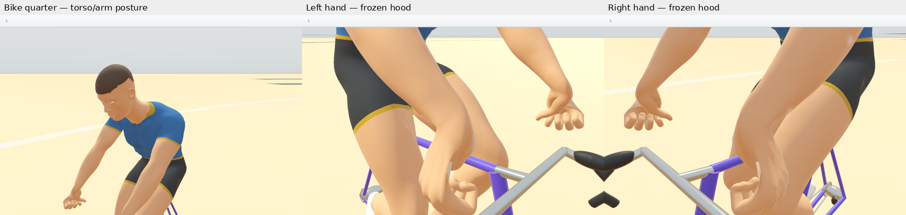
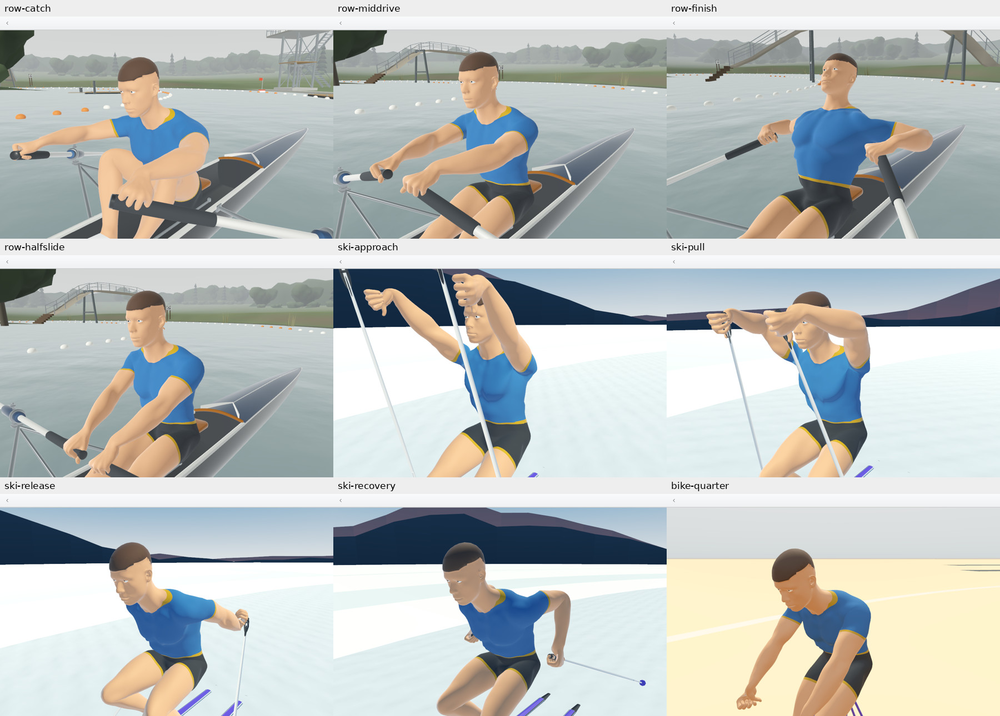

# Blender Phase 5.4 — replacement athlete

Status: **blocked at Layer B acceptance**. Phase 5.4 is **not complete**.
Layer C has not started. ADR 0018's approved Route 3A is used; Route 4 has
not been invoked. The draft asset is a reviewable candidate, not an accepted
final athlete. No additional architectural decision is implemented.

## Fixed-posture reach blocker

BikeErg quarter-cycle exposes an incompatibility between anatomical arm
lengths and the preserved body posture/equipment targets. The candidate's
upper arm is 288.142 mm and forearm 258.560 mm. The current shoulder-to-grip
target distance is 780.247 mm; the measured palm channel offset is 82.8 mm.
Even aiming that offset optimally gives only 629.5 mm of shoulder-to-channel
reach, before joint limits. In the actual solve, both palm channels remain
161.5 mm from the fixed target. The actual rendered palm surface is 83.2 mm
from the closest hood triangle.

An independent conservative skin bound removes the wrist/calibration
assumption altogether. For each palm vertex and each of its skin influences,
sum the bone-translation lengths from the fixed shoulder to that influence
and the vertex's inverse-bind radius. The normalized weighted sum bounds
that skinned vertex for **any** rotations of every arm/hand/finger joint.
The maximum over all palm vertices also bounds every palm triangle.
This allows physically impossible rotations and ignores collisions, so it
overestimates useful reach. It does not assume a cylinder, a helper tip,
the current closure angles, or a favourable vertex subset.

| Bike quarter-cycle | Left | Right |
| --- | ---: | ---: |
| Conservative radius containing all reachable palm skin | 689.437 mm | 689.332 mm |
| Shoulder to nearest actual hood triangle | 708.259 mm | 708.259 mm |
| Minimum possible palm/hood gap under that generous bound | **18.821 mm** | **18.927 mm** |
| Current native palm/hood sampled minimum | 83.182 mm | 83.192 mm |

The measurement uses the same current Qt palette whose 22 light-scheme
hand silhouettes agree with CPU linear skinning (minimum IoU 0.987858).
The final committed evidence records the repeat capture's exact values.
The bound assumes the measured .blend/weights and the fixed shoulder
position; it is not a claim that every conceivable human mesh is unable
to reach this bike. Source overlays place the new shoulder inside the
actual deltoid volume, and elbow/wrist on the anatomical boundary loops.
V4's old source shoulder marker lies above the shoulder surface. Moving
the new bone there or stretching the forearm to V4's 374.940 mm would
repeat the very adaptation this route was meant to replace.

**Stop required by the Phase 5.4 brief:** grip calibration cannot bridge
this distance while preserving the final anatomy, fixed equipment and
current shoulder posture. Options for the owner are a narrowly authorized
anatomical posture/fit recalibration in the Rust pose owner, or a changed
phase boundary allowing equipment fit. Neither has been applied. Keeping
the 225-float frame and 19 semantic bones appears compatible with a posture
change, but that does not authorize changing replay pose semantics. A new
source or Route 4 would not by itself resolve this reach constraint.

No tolerance is raised, no helper count is forced, no QML offset is added,
and no phase is marked accepted. The corrected seat/pelvis, shell, riggers,
rails, stretcher and all equipment remain fixed.

## Authoritative source

`assets/replay/authored/rowplay-athlete-v5.blend` is the modelled source.
`sources/rowplay-human-base-male-v1.4.1.blend` preserves the exact reviewed
CC0 snapshot. ASSET_PROVENANCE.md and MANIFEST.json pin both; the anatomical
base remains CC0, with MIT RowPlay modifications. Export/validation tooling
is GPL-3.0-or-later. No human regeneration script is retained.

Bounded one-off Blender editing was explicitly authorized by the owner.
The source anatomy received a uniform scale of 1.1064884850315604, to 1.87 m
before hair. The modelling operations reduced head/feet density, kept hand
loops, cut deliberate jersey/shorts/cuff regions, shaped a short integrated
scalp, and fitted closed shoes from the base's foot dimensions. Eye iris
colour is albedo; no vertex lighting or downloaded maps are used.

The saved mesh has 48,632 triangles against the 60,000 target and 75,000
hard ceiling. The initial allocation is hands 10,992; arms 9,608; torso
7,236; legs 11,392; feet/shoes 1,058; head/neck 6,984; eyes 596; hair 766.
Full height is 1.875918525 m including hair. Shoulder joint breadth is
0.440382421 m. The contract records every fitted joint centre and bone
length in metres. Final native anatomical/deformation measurements follow
in the acceptance evidence; these counts alone do not establish quality.

New anatomical bone centres, helper pivots and heat-solved skin weights are
stored in the .blend. Four normalized influences at most are exported.
The source distribution is 7,029 vertices with one influence, 8,921 with
two, 4,156 with three, and 4,220 with four (28.895% single-influence).
It is a diagnostic, not a quality target. All 19 semantic and 32 helper
names/hierarchies survive. Final palm/flesh/closure calibration is pending.

## Export and runtime

`tools/blender/export_athlete.py` validates the saved source and exports
eight material primitives in Blender 5.2.2. It creates no artistic
geometry. The repeat export is byte-identical for both GLB and contract.
The source SHA is required explicitly, and an incorrect SHA fails before
the source is opened. Ordinary Cargo builds need only committed outputs.

The 19 semantic animation channels retain the immutable V4 key times and
motion graph, expressed in the fitted bones' bases. V4's node TRS contains
an initial animated pose; its actual semantic inverse-bind rotations are
identity. The exporter verifies that premise. The Rust test compares the
animated world skin rotation deltas against those actual binds, including
between keys. Using V4's node TRS as its bind pose is an instrument error.

Qt Balsam converts only V5. Build-time static material properties bind the
eight explicit roles to the existing Theme colours while preserving the
source's PBR values and albedo. No runtime discovery or new frame crossing
is introduced. V4 bytes remain immutable audit inputs and are neither
converted nor packaged. Historical schema/type identifiers remain for
compatibility; the source/output asset identity is explicitly V5.

## Native evidence in progress

`capture_athlete_v5.py` reuses the Phase 5.1 transform recorder and Phase
5.2 material inventory without changing either historical instrument.
It requires committed inputs, verifies instrument ancestry, selects only
the current Cargo invocation's exact executable/OUT_DIR, pins their bytes,
and verifies all eight actual Qt materials. Captures cover all established
Row/Ski/Bike phases, two schemes and Medium/High tiers.

Initial Qt loading succeeded. The existing quick gate rejects the new
RowErg helper count (8/10 against the legacy 10/10 assertion). This is an
open calibration result, not a reason to change a threshold or claim skin
contact. Native geometry/material acceptance must precede Layer C.

The corrected seat/pelvis baseline and every equipment asset/transform
remain fixed. Phase 6 fit and Phase 7 water work have not started.

## Candidate findings and remaining work

The [bounded native evidence](evidence/blender054/README.md) retains the
exact transform palettes, raw masks, material state, per-digit measurements
and conservative reach proof. [Validation](evidence/blender054/validation.txt)
records 603 passing Qt-free tests, passing fmt/clippy/assets/export tests,
and the unchanged failing full Qt acceptance assertion.

| Observable | Historical V4 | V5 candidate |
| --- | ---: | ---: |
| Complete exported triangles | 106,256 | 48,632 |
| Complete height, including details/hair | 1.894786 m | 1.875919 m |
| Shoulder joint breadth | 480.000 mm | 440.382 mm |
| Upper-arm joint length | 390.141 mm | 288.142 mm |
| Forearm joint length | 374.940 mm | 258.560 mm |
| Left hand PCA extents (open hand, including spread thumb) | 148.814 × 138.441 × 55.625 mm | 213.210 × 160.561 × 59.435 mm |
| Left palm extents in that hand basis | 87.171 × 90.435 × 55.625 mm | 130.700 × 95.268 × 59.435 mm |
| Thigh joint length | 491.471 mm | 474.109 mm |
| Shin joint length | 479.427 mm | 427.428 mm |
| Single-influence source/export vertices | 71.6% (V4 export) | 28.895% (saved source) |
| Ski recovery shoulder rest area compressed below half | 26.42% | 1.86% |
| Ski recovery upper-arm rest area compressed below half | 13.28% | 4.50% |
| Ski pull shoulder rest area compressed below half | 0.54% | 11.99% |
| Row mid-drive upper-arm rest area compressed below half | 0.10% | 6.99% |
| Actual Qt material roles | one uniform active material | eight independent static roles |

The reviewed base's left-hand PCA extents are 192.691 × 145.108 × 53.715 mm.
V5's dimensions are the uniform 1.106488485 scale of those source dimensions;
it does not repeat V4's short/broad hand retarget. PCA breadth includes the
spread thumb and must not be misreported as central palm breadth. The two
weight percentages use different seam duplication bases and are labelled
accordingly. Deformation regions use the historical dominant-bone labelling
rule; changes in weights move region boundaries, so the native images remain
necessary alongside these statistics.

The candidate improves the worst V4 recovery collapse but is **not accepted**:
elbow creases, some shoulder/hip compression and hand webbing remain. The
weight audit finds 703 exported vertices with >1% contralateral thigh or
clavicle influence beyond 50 mm from the midline. Some central torso sharing
is plausible, but the hip transitions need refinement. A bounded local
weight-smoothing trial increased the stressed-region compression fraction
(for example row catch 9.38% to 10.24% after six passes); it was rejected
without changing the saved source. No quality claim follows from reducing
the single-influence percentage.

Initial contact diagnostics are deliberately **not final tolerances**:

| Phase | Helpers | Left/right palm distance to actual equipment |
| --- | --- | --- |
| Row catch | 8/10 | 2.54 / 2.15 mm; digits penetrate the cylinder envelope by up to 22.9 mm |
| Row finish | 8/10 | near zero; palm penetrates the cylinder envelope by 16.5 mm |
| Ski plant | 10/10 | 5.25 / 5.32 mm |
| Ski approach | 10/10 | 64.54 / 64.39 mm |
| Ski release | 10/10 | 65.71 / 66.83 mm; release semantics must be considered before final interpretation |
| Bike top | 10/10 | 69.67 / 71.63 mm |
| Bike quarter | 10/10 | 83.18 / 83.19 mm |

These sampled minima have a ≤1 mm surface-cover bound and use exact
point-to-equipment-triangle distance. Zero minimum can mean intersection,
not successful wrapping. Signed cylinder values are explicitly proxy
diagnostics, not signed distance to the complete irregular equipment mesh.
The full per-digit tables preserve both quantities. Final flesh radii,
closure limits, wrist comfort, thumb placement and contact tolerances have
not been selected. This candidate is not the Phase 6 athlete freeze.

Qt materials were inspected in native Linux Wayland/OpenGL, Medium/light
and High/blue-hour, with normal and close views. All eight roles retain
their source PBR values and albedo; iris colour uses the eye role. No maps
or emission are present. High-tier self-shadow artefacts and the remaining
deformation defects preclude a final visual acceptance claim. These are
Linux results, not macOS/Windows pixel verification.
